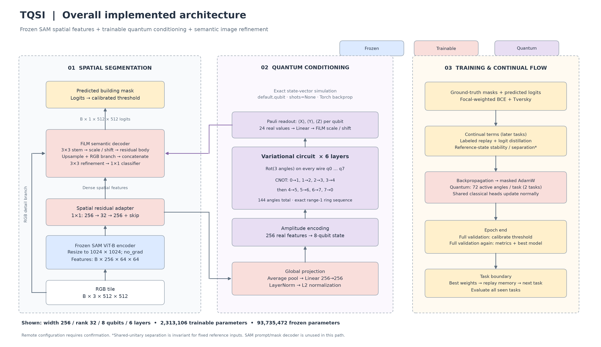
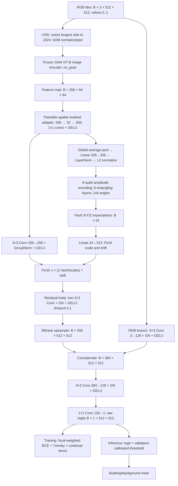
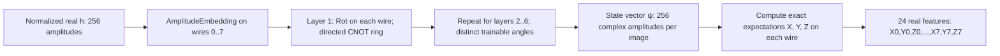

# Implemented TQSI architecture and epoch-time analysis

Analysis date: 7 September 2026. Evidence: this checkout's `tqsi/model.py`, `bottlenecks.py`, `train.py`, `continual.py`, `metrics.py`, dataset/config files, and the supplied training screenshot. No instructions in the screenshot were treated as requests.

Implementation audit (8 September 2026): checked against the local source and installed SAM/PennyLane implementation. Architecture sections describe existing code only. Runtime observations come from the screenshot; operation counts are calculations for the stated configurations, not measured component timings. Unimplemented optimization proposals and projected speedups have been removed.

| Documented component | Implementation source |
|---|---|
| Frozen SAM encoding and complete forward path | [`FrozenSAM`, `TQSI.forward`](../tqsi/model.py) |
| Spatial adapter, FiLM, residual body, RGB refiner | [`SpatialLoRAAdapter`, `FiLMSpatialDecoder`](../tqsi/model.py) |
| Quantum encoding, gates, readout and task masks | [`QuantumBottleneck`](../tqsi/bottlenecks.py) |
| Segmentation/auxiliary losses and protected optimizer updates | [`segmentation_loss`, `TaskController`, `masked_step`](../tqsi/continual.py) |
| Replay, calibration, evaluation, DDP and checkpoint flow | [`run` and supporting functions](../tqsi/train.py) |
| Boundary IoU and segmentation metrics | [`Metrics`](../tqsi/metrics.py) |
| Width-256/rank-32 two-task configuration shown in the overview | [`dgx_sota_continual.yaml`](../configs/dgx_sota_continual.yaml), inheriting [`dgx_sota_single_task.yaml`](../configs/dgx_sota_single_task.yaml) |

Audit checks reproduced both trainable totals, 72 quantum mask entries per task, and the PennyLane layer decomposition of 48 Rot gates plus 48 CNOTs with the documented ring order. Optional ablation paths below are implemented alternatives, not additional components of the pictured model. The profiling scripts are separate analysis utilities, not training-network layers.

## Scope and configuration certainty

The screenshot is a remote VS Code session on 172.16.0.32 and shows a `dgx_ai4cv_continual.yaml` tab. That file and the current run's resolved configuration are **not present in this local checkout**. Therefore the diagrams describe the implemented local architecture; the exact active remote model must be confirmed from its `resolved_config.json` and `environment.json`. Batch size 8, RGB 512×512 inputs, 24 epochs, and the measured epoch times are visible in the screenshot. Width, adapter rank, and remote code version are not visible.

Two local configurations are reported:

| Configuration | Decoder width | Adapter rank | Qubits/layers | Classes |
|---|---:|---:|---:|---:|
| `base.yaml` / `dgx.yaml` | 192 | 16 | 8 / 6 | 1 binary logit |
| `dgx_sota_single_task.yaml` / `dgx_sota_continual.yaml` | 256 | 32 | 8 / 6 | 1 binary logit |

Both use frozen SAM ViT-B, a quantum bottleneck, `spatial_fpn`, and an image refiner. Despite the `spatial_fpn` name, this is a **single-scale FiLM-conditioned convolutional decoder**, not a conventional multi-level feature pyramid. The adapter is on the output feature map, not LoRA inside SAM's attention blocks.

## Overall architecture at a glance



**Figure 1.** Overall view of the implemented spatial-decoder TQSI model, styled as grouped architecture panels with the reference image's soft colors and directional flow. Blue denotes frozen components, coral trainable classical components, purple the quantum conditioning branch, and cream predictions/losses/workflow. The first two panels show the inference network; the third summarizes training. Its predicted-logit input comes from the semantic decoder, before thresholding. The RGB detail branch bypasses SAM and joins the image refiner inside the semantic decoder.

The figure uses the local width-256/rank-32 configuration: **2,313,106 trainable parameters**, including **144 quantum angles**, plus **93,735,472 frozen parameters**. For two tasks, 72 quantum angles are updated per task; all angles participate in inference. The active remote configuration still needs confirmation. The VAE, ELBO selector, and task-alignment router in the supplied style reference are not part of this implementation.

[Download the scalable SVG](figures/tqsi_overall_architecture.svg) · [High-resolution PNG](figures/tqsi_overall_architecture.png). Regenerate both with `python scripts/draw_architecture_overview.py` from the repository root.

## Full architecture diagram

Shapes below use width 256, rank 32, batch B, and one output class. Blue-path descriptions marked frozen have no parameter updates.



The frozen SAM prompt encoder and mask decoder remain instantiated, but are **not called in this spatial decoder path**. The trainable quantum output supplies global conditioning; dense SAM features and the RGB branch provide spatial information.

SAM ViT-B internally uses a 16×16 patch embedding (1024→64 spatial grid), 12 transformer blocks at embedding width 768, then a convolutional neck producing 256 channels. Freezing removes its backward graph, not its forward computation. Images are encoded again on each forward; there is no SAM feature cache in this implementation.

## Quantum network



The state starts as `|ψin⟩ = Σ h[j]|j⟩`, with `Σ h[j]² = 1`. The normalized projection feeds amplitude encoding; a near-zero vector falls back to the first basis vector. Each of six layers applies one three-angle `Rot` gate on each of eight wires, followed by range-1 entanglement. The ring's directed CNOT sequence is:

```text
Every layer ℓ = 0..5:
  q0: Rot(θℓ,0,0, θℓ,0,1, θℓ,0,2)
  q1: Rot(θℓ,1,0, θℓ,1,1, θℓ,1,2)
  ...
  q7: Rot(θℓ,7,0, θℓ,7,1, θℓ,7,2)
  then CNOT 0→1, 1→2, 2→3, 3→4, 4→5, 5→6, 6→7, 7→0
```

Total: 48 Rot gates, 144 trainable angles, and 48 CNOTs, excluding state preparation. State preparation has no separately learned angles. Readout is computed from the returned state using tensor operations, not 24 separately sampled circuits. The circuit uses PennyLane `default.qubit`, `shots=None`, Torch backpropagation, and one broadcast QNode invocation per input batch. This is a classical state-vector simulation, not execution on a quantum processor. There is no parameter-shift loop in this code.

For two tasks with qubit masks, task 0 updates angles on wires 0–3 and task 1 on wires 4–7: **72 angles active per task**. All 144 remain registered trainable parameters, and the full circuit executes for every task. Task masks constrain updates; they do not select separate inference networks. Classical trainable layers remain shared and update for both tasks. For one task all 144 angles are active.

## Verified parameter counts

Counts were calculated by instantiating the installed SAM ViT-B and the actual decoder/adapter classes locally, without loading a checkpoint or running a GPU workload. Checkpoint values do not change these architecture counts.

| Component | Width 192 / rank 16 | Width 256 / rank 32 | Status |
|---|---:|---:|---|
| SAM image encoder | 89,670,912 | 89,670,912 | Frozen; used |
| SAM prompt encoder | 6,220 | 6,220 | Frozen; unused in spatial path |
| SAM mask decoder | 4,058,340 | 4,058,340 | Frozen; unused in spatial path |
| Spatial adapter | 8,193 | 16,385 | Trainable |
| Global projection + LayerNorm | 66,304 | 66,304 | Trainable |
| Quantum circuit | 144 | 144 | Trainable; masked updates |
| FiLM spatial decoder, including RGB refiner | 1,368,577 | 2,230,273 | Trainable |
| **Total trainable** | **1,443,218** | **2,313,106** | |
| **Total frozen** | **93,735,472** | **93,735,472** | |
| **Total registered model parameters** | **95,178,690** | **96,048,578** | |

The width-256 model has about 2.41% of registered parameters trainable; quantum angles are only 0.0062% of its trainable parameters. A small parameter count does not guarantee low compute cost.

For width W, R=max(32,W//2), rank r, C=256, K=1 and quantum readout D=24:

- Adapter: `2*C*r + 1` (two bias-free 1×1 kernels and learned scalar).
- Projection: `C*256 + 256 + 2*256 = 66,304`.
- Quantum: `6*8*3 = 144`.
- Decoder: `9*C*W + 6*W + 2*W*(D+1) + 18*W² + 27*R + 4*R + 9*(W+R)*R + R*K + K`.

Alternative implemented paths: `sam_prompt` projects the 24-vector to class-specific 256-channel dense prompts, optionally adds two spatial 1×1 convolutions, and executes the frozen SAM mask decoder per image with gradients to prompts. Its counts differ. `classical_unconstrained` replaces the quantum module with 256→96→24 GELU MLP (27,000 parameters). `classical_orthogonal` uses a 256×256 learned A, `exp(A−Aᵀ)`, and 256→24 head (71,704 parameters). Neither is the configured quantum path above.

## Detailed training and continual flow

1. Resolve config inheritance, seed random generators, choose device, and initialize DDP only if `WORLD_SIZE > 1`. A notebook `run(...)` call alone does not automatically use every DGX GPU.
2. Build source splits, validate label mapping, and tile paired image/mask files. Landcover label 1 is building; OpenEarthMap label 8 is building and label 0 is ignored. Training uses paired flips/90° rotations and configured foreground sampling. Images become float RGB; targets are integer masks.
3. Initialize frozen SAM plus the adapter, projection, bottleneck, and semantic decoder. Register detached task reference vectors and an encoder prototype. Reference registration currently projects raw encoder features directly, bypassing the spatial adapter; these vectors are fixed inputs for the auxiliary losses, not refreshed image representations.
4. For each training batch, transfer images/masks to GPU. On later tasks, append replay samples when enabled. The local continual SOTA config adds up to 8 replay images to 8 current images, increasing actual forward batch size to 16.
5. Execute the diagram. Compute focal-weighted binary cross entropy plus soft Tversky. Defaults: per-batch automatic positive weighting clamped to [1,20], focal gamma 1.5, Tversky FP weight 0.3/FN weight 0.7, overlap weight 1.
6. Add configured auxiliary terms: `L = Lseg + λsep*Lsep + λstab*Lstab + replay_weight*Lreplay + distill_weight*MSE(replay_logits,stored_logits)`. Replay targets/logits come from earlier tasks. On task 0 the separation/stability terms are zero and unnecessary reference circuit calls are skipped.
7. Backpropagate. Mask quantum gradients and Adam state, clip gradient norm to 1, step AdamW, then restore protected angles and clear protected optimizer moments. The classical adapter/projection/decoder update normally. Default SOTA LR is 0.001 for classical heads and 0.0001 for the bottleneck, with cosine scheduling.
8. Update train metrics, including boundary IoU, on every batch. Training uses logit threshold zero for metrics.
9. At epoch end, run **the entire validation set once to calibrate** a binary logit threshold using streaming counts over a 257-point probability grid maximizing Dice. This transfers logits to CPU and bucketizes pixels.
10. Run **the entire validation set again** with that threshold to calculate loss, IoU, Dice, accuracy, and boundary IoU. Select the best checkpoint by configured validation IoU. Calibration and evaluation use the same validation split; final held-out tests remain separate.
11. After a task, restore its best checkpoint, store quantum reference states, construct replay memory and teacher logits, test all seen tasks, and save task-complete resume state. Optional quality gates compare old-task IoU. Router prototypes are diagnostic and do not change segmentation predictions. Final evaluation/plots/t-SNE and checkpoint writes add time outside epoch timing.

For a shared unitary U, `|⟨Ua,Ub⟩|² = |⟨a,b⟩|²`. Thus the reference separation loss cannot learn separation by changing this shared quantum circuit for fixed inputs; it is a diagnostic invariant. Stability against stored old states can still change and supply gradients. Task masks alone do not guarantee that old predictions remain unchanged because the circuit and classical decoder are shared.

## Where the hour goes: measured screenshot timing

| Stage | Epoch 1 | Epoch 2 | Share of epoch 2 |
|---|---:|---:|---:|
| Training, 1,049 batches | 35:21 = 2,121 s | 34:19 = 2,059 s | 58.76% |
| Calibration, 311 batches | 12:19 = 739 s | 12:02 = 722 s | 20.61% |
| Evaluation, 311 batches | 12:10 = 730 s | 12:00 = 720 s | 20.55% |
| Remainder/rounded display difference | 1.65 s | 2.78 s | 0.08% |
| **Reported epoch** | **3,591.65 s = 59.86 min** | **3,503.78 s = 58.40 min** | **100%** |

Analogy: each epoch spends about **35 minutes learning, 12 minutes choosing the decision cutoff, and 12 minutes scoring the model again**. The hour is not an hour of gradient training. Epoch 2 training averages 1.963 s/batch; calibration 2.322 s/batch; evaluation 2.315 s/batch. Validation batches being slower despite no backward pass warrants measurement of input loading, CPU calibration, and different train/eval kernels rather than an assumption that backward dominates.

At a constant epoch-2 rate, 24 epochs are about **23.36 hours per task**, excluding task setup, test passes, and artifacts. Two equally sized tasks would be 46.72 hours, but actual task 2 has different data and may include replay, so this is an analogy, not a forecast.

The first-batch trace reports 7.50 s initial data wait, 0.86 s forward, 0.04 s losses, 0.42 s backward/optimizer, and 0.04 s metrics. These are one startup sample, not average per-stage timings. They do not identify the average quantum cost or explain the 2 s steady-state iteration by themselves. GPU 0 is at 100% utilization and 22,737 MiB at the captured instant; this supports activity on that GPU at that instant, not sustained saturation or a claim about other GPUs.

## Runtime work present in the implementation

**Two full validation forwards per epoch.** `run()` calls `calibrate_binary_threshold()` and then `evaluate()`. Each iterates over the validation loader and calls the full model. Evaluation therefore repeats frozen SAM, the circuit, and the decoder after calibration. The screenshot measures these passes at 722 s and 720 s in epoch 2. There is no shared validation-logit cache or combined pass in this implementation.

**High-resolution refinement.** `FiLMSpatialDecoder.forward()` upsamples before concatenation and refinement. At width 256, its 3×3 384→128 convolution operates at 512×512: about **115.96 billion MACs/image**, or **927.71 billion MACs per batch of 8**, forward only. Counting multiply/add separately doubles the FLOP figure. Width 192 costs about 65.23 billion MACs/image in this convolution. The width-256 upsampled feature tensor alone is 2 GiB at batch 8 in float32; the concatenation is 3 GiB. These are operation/storage calculations for the implemented layer, not measured time shares.

**Frozen encoder is recomputed.** `TQSI.forward()` calls `backbone.encode()` each time. For 512×512 tiles, `FrozenSAM.encode()` resizes to 1024×1024 before SAM encoding. There is no encoded-feature cache, including during validation.

**Precision:** the inspected training path has no autocast or GradScaler. The dataset returns float32 images; the quantum path explicitly converts inputs/weights to float32 and the returned state to complex64. Mixed-precision training is not implemented in this path.

**CPU and metric work:** calibration copies logits to CPU and bucketizes all valid pixels. `Metrics.update()` computes a 29×29 pooling-based boundary at 512×512 for both binary classes (width rounds to 14), plus ignored-region pooling and CPU count transfers. The trainer calls metrics on every training and evaluation batch. TIFF loading in this checkout includes memory-map/fallback caches and uncommitted data changes, which may differ from the remote runtime. No steady-state timing for these individual operations is available.

**Quantum work:** each model forward invokes the broadcast state-vector circuit, followed by tensor-based Pauli readout. On later tasks, enabled auxiliary losses also invoke the circuit on stored reference inputs through `TaskController.losses()`. The implementation uses `default.qubit` and backpropagation. The screenshot does not isolate its runtime contribution.

**Multiple GPUs:** the trainer enables DDP when `WORLD_SIZE > 1`; `environment.json` records `world_size`. Calibration/evaluation execute on rank 0, with a barrier at the end of the epoch. Replay adds old-task images to model forwards when configured. The screenshot alone does not establish the remote run's world size.

## Measured architecture smoke benchmark — 8 September 2026

**These results come from a separate executed benchmark, not from the screenshot or arithmetic estimates.** The previous architecture timing estimate section has been replaced by these measurements.

Hardware: **NVIDIA GeForce RTX 3050 Laptop GPU, 4 GB**, PyTorch **2.5.1+cu121**, Windows. Model: checkpoint-loaded frozen SAM ViT-B, width-256/rank-32 spatial decoder, 8-qubit/6-layer quantum bottleneck, one class. Input: **batch 1, RGB 512×512**, synthetic random images and binary targets already on GPU. The trainable heads use initialization, not the remotely trained checkpoint. No architecture dimensions were reduced to fit memory; only batch size differs from the remote run.

Procedure: **2 warmup + 5 measured iterations in training mode**, followed by **2 warmup + 5 measured iterations in evaluation mode**. CUDA synchronization surrounds each timing region, so measurements include host dispatch and device completion. Every training iteration executes the full model, segmentation loss, backward, and metrics; evaluation disables gradients. Loss and gradient finiteness checks passed. This is an architecture forward/backward smoke benchmark, not optimizer training or an accuracy test.

| Region | Train-mode mean | Eval-mode mean | Share of train forward |
|---|---:|---:|---:|
| **SAM encoder, including preprocessing** | **472.55 ms** | **468.34 ms** | **72.7%** |
| **Quantum bottleneck, including readout** | **97.44 ms** | **77.83 ms** | **15.0%** |
| **Entire spatial decoder** | **78.74 ms** | **78.62 ms** | **12.1%** |
| Spatial adapter | 0.57 ms | 0.51 ms | 0.09% |
| Global projection | 0.36 ms | 0.34 ms | 0.06% |
| **Full forward** | **650.33 ms** | **626.22 ms** | **100%** |
| Segmentation loss | 3.01 ms | 2.17 ms | Outside forward |
| **Full backward** | **262.59 ms** | Not executed | Outside forward |
| Metrics, including boundary IoU | 8.31 ms | 8.18 ms | Outside forward |

Component totals can differ slightly from the full-forward total because of uninstrumented operations, dispatch and timer overhead. The backward measurement covers all trainable components together; no per-module backward attribution is claimed.

Inside the decoder (nested measurements; **do not add these again** to its total):

| Decoder region | Train-mode mean |
|---|---:|
| **Refinement block: 3×3 convolution + GroupNorm + GELU + 1×1 classifier** | **61.05 ms** |
| RGB image branch | 7.43 ms |
| Residual body | 1.93 ms |
| Stem | 1.01 ms |
| FiLM linear projection | 0.13 ms |
| Remaining decoder operations and overhead, by subtraction | 7.19 ms |

The refinement block contributes **77.5% of measured decoder forward time**. The remaining decoder work includes scale/shift application, residual addition, interpolation and concatenation; these were not separately timed.

**Measured conclusion:** SAM is the largest forward component on this hardware. Quantum forward is second, slightly ahead of the full decoder at batch 1. The decoder's main internal hotspot is the refinement block. This corrects the earlier arithmetic-only ordering: simulator overhead matters even with just 144 quantum angles.

Adding the non-overlapping timed regions gives **924.23 ms per training forward/loss/backward/metrics cycle** and **636.57 ms per evaluation forward/loss/metrics cycle**. These sums exclude optimizer updates, gradient checks, zeroing, input loading/transfers, replay, auxiliary reference losses, threshold calibration, checkpointing and loop overhead. They are not end-to-end training-step or epoch measurements. Observed training-forward samples range from 632.59–694.76 ms; quantum-forward samples range from 80.72–138.47 ms. Five samples support a short smoke comparison, not a precise long-run performance claim.

**These results must not be scaled directly to A100 batch-8 epoch time.** Different GPU throughput, memory bandwidth, batch size, driver and simulator overhead can change both timings and ordering. The DGX job was not modified or interrupted.

Artifacts: [raw measurements and all samples](../outputs/architecture_timing_smoke/measured_components.json), [isolated config](../configs/architecture_timing_smoke.yaml), [benchmark implementation](../scripts/inspect_architecture.py).

Command executed locally (choose a new JSON filename for a repeat):

```powershell
.conda-cuda/python.exe -u -m scripts.inspect_architecture --config configs/architecture_timing_smoke.yaml --output outputs/architecture_timing_smoke/measured_components.json --profile --device cuda:0 --warmup 2 --steps 5
```

## Obtain exact remote counts and component timings

Use the training environment and current run's saved configuration on the DGX. The added script uses the implemented modules and does not change training files or optimizer state:

```bash
# Counts only: CPU construction; replace the path with the current output directory.
python -m scripts.inspect_architecture --config outputs/YOUR_RUN/resolved_config.json --output architecture_counts.json

# On an otherwise idle GPU; initialized heads and synthetic inputs, not the live model.
python -m scripts.inspect_architecture --config outputs/YOUR_RUN/resolved_config.json --output architecture_profile.json --profile --device cuda:1 --warmup 3 --steps 10

# Existing end-to-end profiler: real data, optimizer, replay, and metrics.
python -m scripts.profile_batches --config configs/dgx_ai4cv_continual.yaml --output outputs/profile_idle_gpu --batches 8 --warmup 3 --steps 10
```

For the existing batch profiler, set `device` in a separate config to the idle GPU first; its default `auto` resolves to CUDA 0. It starts short independent training trajectories and writes separate outputs. The new synthetic profiler measures synchronized encoder, adapter, projection, circuit, decoder, loss, backward, and metrics regions. It excludes data loading, transfers, optimizer, auxiliary losses, replay, and calibration; therefore it cannot be extrapolated directly to the whole epoch. The real-data profiler complements it with aggregate training throughput. For exact live per-stage attribution, collect representative real train and validation batches with synchronized phase timers or a Torch profiler trace on the DGX.

A local CUDA architecture smoke benchmark was completed on 8 September 2026 using the RTX 3050 Laptop GPU; see the measured results above. No A100 component benchmark was performed, and the active remote job was not accessed. Screenshot epoch timing is historical context only and was not used to calculate the smoke results.
